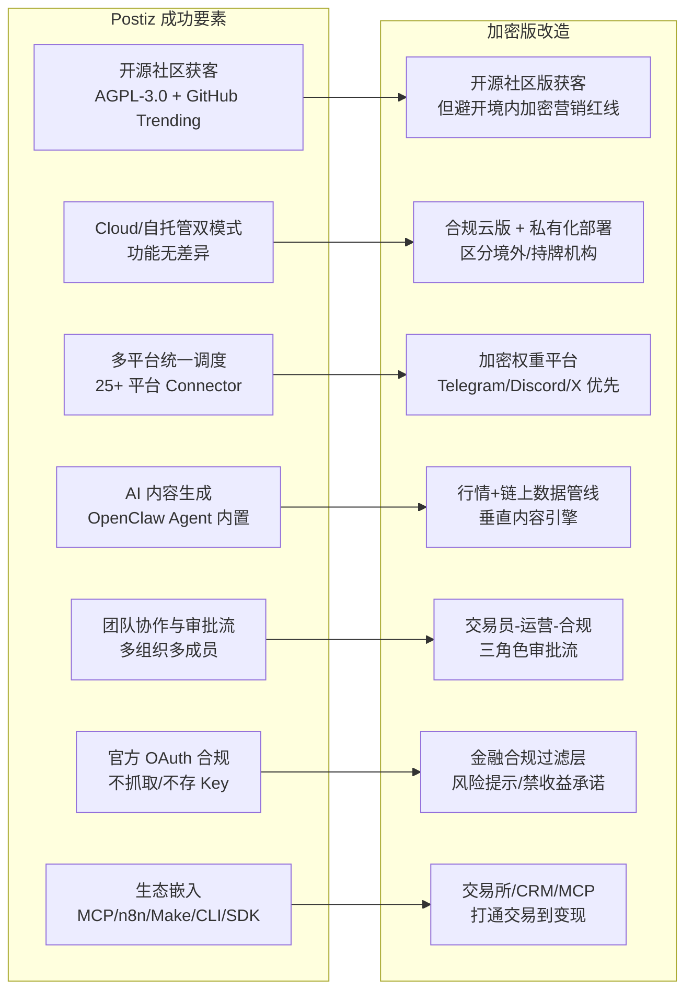

# Postiz 借鉴分析：工程架构、商业模式与加密场景改造

Postiz 最值得借鉴的核心是它的"AGPL-3.0 开源 + 自托管与云版功能无差异 + 官方 OAuth 合规姿态"三位一体打法，而不是它的内容生成或多平台连接器本身。你要做的加密交易员营销智能体，真正能"偷师"的是它的工程架构、商业模式与社区运营机制；至于内容生成、平台连接、自动化互动这些表层功能，由于加密场景的金融合规与平台风控差异，大部分必须重做。

下面这张图把 Postiz 的七大成功要素和你在加密场景的对应改造路径放在了一起对照：

## Postiz 成功要素逐条拆解

Postiz 由 GitroomHQ 团队开发，2024 年开源，采用 AGPL-3.0 协议，技术栈是 NX monorepo + NextJS + NestJS + Prisma(PostgreSQL) + Redis(BullMQ) + Temporal + Resend。它对外明确声明"目前 hosted 版与 self-host 版功能无差异"，这是它 open-core 打法的根基。截至 CSDN 报道时，Postiz 在 GitHub 已获 5000+ Star，月活用户超 10 万，支持 25+ 主流社媒平台，云版 $29/月起。

从 Postiz 官网看，它的生态嵌入非常激进：Tools API、MCP、N8N Custom Node、Make.com integration、AI Agents CLI、Claude Cowork、Hermes Agent、Perplexity Computer、Codex 全都有对外接口。其 NodeJS SDK 直接 `import Postiz from '@postiz/node'` 就能在自家应用里调度发帖。

合规姿态是另一个关键：Postiz 明确"使用官方、平台批准的 OAuth 流程，不自动化或抓取社交媒体平台的内容，也不收集、存储或代理用户的 API 密钥或访问令牌，用户始终直接与社交平台进行身份验证"。这一条让它在各平台风控下长期存活。

## 借鉴对照表

| Postiz 做法 | 可复用程度 | 加密交易员场景的落地建议 |
|---|---|---|
| AGPL-3.0 开源，GitHub Trending 获客 | ⭐⭐⭐⭐ 直接复用 | 开源社区版以"加密营销自动化技术"为话题，GitHub README 不出现交易/收益承诺话术；境内分发需谨慎，主攻海外开发者社区 |
| Cloud 与自托管功能无差异 | ⭐⭐⭐⭐ 直接复用 | 合规云版做 SaaS 订阅，私有化部署给交易所/持牌机构；明确两版功能对齐，避免开源版"阉割感" |
| 多平台 Connector 插件化架构 | ⭐⭐⭐ 部分复用 | 复用其 libraries/plugins 抽象，但平台权重重排：Telegram Channel/Group、Discord、X 放首位，TikTok/YouTube 次之 |
| OpenClaw AI Agent 内置内容生成 | ⭐⭐ 重做 | 通用文案生成不可直接用；必须接行情 API、链上数据、新闻源，做"行情复盘/异动解读/交易日志"垂直内容引擎 |
| 团队协作 + 内容日历 + 多组织 | ⭐⭐⭐⭐ 直接复用 | 复用其多成员/多组织结构，并扩展"交易员-运营-合规审核"三角色审批流，适配持牌机构 |
| 官方 OAuth，不抓取不存 Key | ⭐⭐⭐⭐⭐ 必须复用 | 加密场景账号被盗=资产风险，更要严守"用户直连平台 OAuth、服务端不持久化 Token"；Telegram/Discord 用官方 Bot API |
| MCP/n8n/Make/CLI/SDK 生态嵌入 | ⭐⭐⭐⭐ 直接复用思路 | 交易员普遍用 n8n/Make 做自动化，把你的工具做成他们工作流里的一个发布节点；新增交易所 API、CRM、链上监控的 Connector |
| RSS 自动同步、触发式互动、Webhook | ⭐⭐ 谨慎复用 | RSS 同步可保留；触发式互动（自动点赞/评论/关注）在加密场景极易触发平台风控，建议降级或加拟人化间隔 |
| Temporal 任务调度引擎 | ⭐⭐⭐⭐⭐ 直接复用 | 完全沿用其 Temporal 编排，天然适配"行情触发→生成→审核→发布"多步工作流 |
| docker-compose 一键部署 | ⭐⭐⭐⭐⭐ 直接复用 | 沿用其 Docker 部署模式，降低自托管门槛，也是社区贡献入口 |

## 三个关键借鉴方向的具体路径

### 1. 开源+自托管的获客与商业模式

直接 fork Postiz 的 open-core 模型：核心调度引擎、Connector 抽象、AI 内容层全部开源（AGPL-3.0），社区版与云版功能对齐，云版靠"免运维 + 合规审计 + 企业级 SLA"收费。这与前面问的可行性结论一致——开源社区版主攻海外开发者与持牌机构，合规云版做 SaaS 订阅，境内加密交易营销则要避开。

技术栈建议直接沿用 Postiz 的 NextJS + NestJS + Prisma + Temporal + Redis 组合，能省 3–6 个月基建时间。部署沿用其 `docker-compose up` 一键启动模式，降低社区贡献者上手成本。

### 2. 多平台与生态集成的取舍

Postiz 的 Connector 抽象层（libraries/plugins）值得直接复用，每个平台封装成独立插件，新增平台只需实现统一接口。但你的平台权重必须重排：Telegram Channel/Group、Discord 是币圈私域核心，权重最高；X 次之；TikTok/YouTube 再次；国内平台（微博/抖音/小红书/B站）在加密合规风险下建议不内置或做地区屏蔽。

生态嵌入复用 Postiz 的 MCP server + n8n custom node + Make.com integration + NodeJS SDK 思路。交易员普遍已用 n8n/Make 做自动化交易与通知，把你的工具做成他们现有工作流里的一个发布节点，获客成本极低。新增的差异化 Connector 包括：交易所 API（Binance/OKX/Bybit）、CRM、跟单系统、链上监控（Etherscan/Nansen）。

### 3. 合规与风控的加固（Postiz 没做但加密场景必须做）

这是与 Postiz 最大的差异，也是不能"偷懒复用"的部分。Postiz 的合规只到"平台 OAuth 不违规"，加密版必须叠加两层：

**第一层：金融合规过滤。** Postiz 的内容生成是"给 prompt 出通用文案"，加密版必须新增：
- 禁用词库（屏蔽"保本保收益""翻倍""内部消息"等违反各国金融广告法的表述）
- 风险提示自动注入（每条含交易观点的内容追加"DYOR / 投资有风险"）
- 司法辖区路由（按发布账号注册地与目标受众区分内容版本，避开某地禁令）
- 审批流在 Postiz 单层协作基础上加一道合规预审

**第二层：平台风控与反作弊。** Postiz 默认的批量发布、触发式互动（自动点赞/评论/关注）在币圈场景极易触发 X/Telegram/Discord 风控。必须做：
- 发布间隔随机化
- 内容去重
- 账号健康度实时监控
- 影子封禁检测与自动降级
- 明确不做自动刷赞/刷评论/买粉——这不仅是平台违规，在美/港等地还可能触碰证券欺诈相关红线

## 落地优先级建议

1. 先 fork Postiz 的工程骨架（NX monorepo + NestJS + Prisma + Temporal + Docker），省掉基建时间，把精力压在差异化模块
2. Connector 层先做 Telegram + Discord + X 三个，覆盖币圈私域+公域主战场，验证"一次编辑多端分发"在加密内容上的可行性
3. 数据管线与合规过滤层从 MVP 阶段就做，不要后置——这是相对于 Postiz 的核心壁垒，也是规避监管风险的关键
4. 云版与社区版功能对齐，靠合规审计与企业 SLA 变现，而非靠"阉割开源版"收费，这一点直接学 Postiz 的姿态
5. MCP/n8n/Make 集成尽早开放，让交易员把你嵌入他们已有的自动化工作流，这是最低成本的获客路径

Postiz 给的是一套经过验证的工程范式与商业模式，但它解决的是"通用社媒运营"这个无争议场景。借它的"形"，但"神"——即金融合规过滤与垂直内容引擎——必须自己造。
