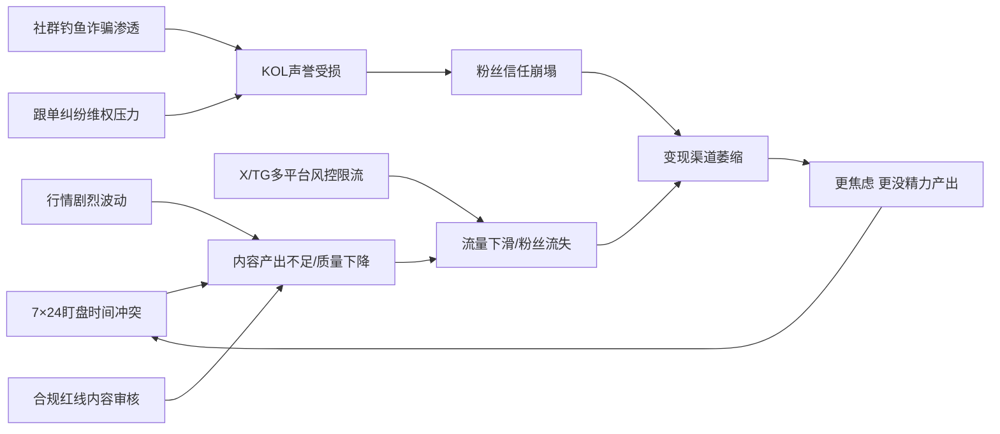

# 加密货币交易员运营自媒体痛点分析

加密货币交易员运营自媒体的痛点可归纳为五大类：盯盘与内容输出的时间冲突、行情实时性与内容滞后性的矛盾、多平台风控与限流、社群信任与钓鱼诈骗侵蚀、变现与合规的两难。这些痛点彼此交织，形成"越忙越没时间产出→内容质量下降→流量下滑→变现更难→更焦虑"的恶性循环。

下面这张图展示了这些痛点如何相互关联，最终导致交易员"内容产出-流量-变现"三重崩塌：

## 一、时间与精力冲突类痛点

加密市场 7×24 小时运转，没有开盘收盘的概念，交易员的注意力被行情深度占据，留给内容生产的整块时间几乎为零。这类痛点的具体表现：

**盯盘与写作的零和博弈**：行情剧烈波动时恰恰是内容黄金期（有素材、有话题、有流量），但此时也是交易决策最密集、容错率最低的时刻，写一条推文可能错过一个百点的入场窗口。

**跨时区受众覆盖**：加密市场全球性，美国、亚洲、欧洲三个时区的活跃时段不同，单一时区的交易员很难持续覆盖全部受众，导致部分流量被其他时区 KOL 截流。

**复盘与传播的节奏错位**：交易员的复盘往往是盘后私密进行的，要把复盘结论转化为可公开传播的内容，需要再加工（脱敏、配图、话术打磨），这个"翻译"过程耗时且容易失真。

这类痛点的本质是：交易员的核心能力是判断，不是传播，但自媒体要求两者兼备。

## 二、内容专业性与合规类痛点

加密内容对专业性、时效性、合规性三重要求都极高，任何一个维度出问题都会带来实际损失。

**行情解读的实时性 vs 内容生产的滞后性**：交易员看到异动到发出内容之间天然有延迟，等推文写完，行情可能已经走完一波，内容变成"事后诸葛亮"，粉丝信任度下降。

**金融合规红线**：不能做收益承诺、不能荐币、需要标注风险提示——这些约束让很多交易员的真实观点无法直接表达，内容变得"安全但无趣"。国内平台对虚拟货币内容的审核尤其严格，币乎等加密内容平台因监管收紧和 token 激励衰退已陆续停运。

**知识门槛的双向拉扯**：写得太专业，小白看不懂，流量起不来；写得太通俗，专业粉丝觉得没深度，留存下降。交易员很难在两者之间找到平衡点。

## 三、多平台风控与流量类痛点

加密内容在主流平台普遍处于"高风险标签"区间，风控和限流是常态。

**X/Twitter 的 shadowban 与 graduated access**：X 平台对加密相关账号有内部限流机制，账号可能被悄悄降低 reach 而不自知，需要专门工具（如 Shadowban Scanner）才能检测。

**多账号矩阵运营的封号风险**：平台并非因为"账号多"而封号，而是识别"异常行为"——短时间内大量重复操作、频繁切换 IP/设备、非官方接口调用都会触发风控。加密 KOL 普遍需要多账号分发，但稍有不慎就会全军覆没。

**国内平台的加密内容禁区**：微信公众号、微博、抖音等对虚拟货币相关内容持续整治，大量币圈自媒体账号被永久封禁。

**算法变化导致流量不稳定**：平台算法调整对加密垂类影响尤为明显，一条爆款之后可能长期低迷，流量可预测性差。

## 四、社群信任与钓鱼诈骗类痛点

这是加密 KOL 独有的、最致命的一类痛点——社群一旦被诈骗渗透，KOL 多年积累的声誉可能一夜归零。

**钓鱼诈骗冒充 KOL**：攻击者注册高仿 KOL 账号，借助平台热门标签发布"限时空投""保本理财"等诱导文案，内嵌恶意链接，用户点击后钱包被授权盗空。

**社群被钓鱼链接渗透**：据统计，近两年超 43% 的加密资产被盗案件源头可追溯至交易所社区、社交广场等 UGC 内容平台，攻击者通过私信、评论区留言批量触达用户。

**粉丝质量参差**：Telegram/Discord 社群里 bot 粉、羊毛党、白嫖党占比高，真正愿意付费或跟单的高质量用户比例低，社群运营投入产出比差。

**跟单纠纷与维权压力**：一旦推荐标的亏损，粉丝往往归咎于 KOL，维权群、曝光帖、人身威胁随之而来，声誉和心理健康双重承压。

这类痛点的本质是：加密 KOL 的信任资产极其脆弱，一次诈骗冒充事件就可能让多年积累清零，且 KOL 自己往往无法控制。

## 五、变现与商业模式类痛点

加密 KOL 的变现链条长、不确定性高，且与合规高度冲突。

**变现渠道碎片化**：广告赞助、付费社群、跟单分成、代投、项目方合作、空投返佣……渠道多但每个都不稳定，且多数游走在合规边缘。

**付费转化率低**：加密用户付费意愿整体偏低（习惯了免费信息和空投），付费群转化率通常只有个位数百分比，且续费率低。

**赞助合作的合规与声誉风险**：项目方赞助内容若项目暴雷，KOL 会被扣上"站台诈骗"的帽子；品牌方与 KOL 合作前若背调不全，可能触碰到"品牌对立面"KOL，引发舆情危机。

**收益与声誉的内在矛盾**：赚钱的内容（喊单、带单、项目推广）往往损害声誉；维护声誉的内容（科普、客观分析）往往不赚钱。交易员很难在两者之间找到可持续的平衡。

## 痛点清单速查表

| 痛点类别 | 具体痛点 | 典型场景 | 对智能体的需求映射 |
|---|---|---|---|
| 时间精力冲突 | 盯盘与写作零和博弈 | 行情异动时无暇写推文 | 行情触发→自动生成短内容 |
| 时间精力冲突 | 跨时区覆盖难 | 亚洲时段发帖，欧美时段无人运营 | 定时排期+多时区分发 |
| 时间精力冲突 | 复盘到传播的加工耗时 | 盘后复盘结论无法快速公开化 | 交易日志→脱敏→内容模板 |
| 内容专业性 | 实时性 vs 滞后性 | 等写完行情已走完 | 异动监测→即时短推草稿 |
| 内容专业性 | 合规红线约束 | 真实观点无法直接表达 | 合规过滤层+风险提示注入 |
| 内容专业性 | 专业 vs 通俗两难 | 专业粉嫌浅，小白粉嫌深 | 多版本内容自动改写 |
| 平台风控 | X/Twitter shadowban | 账号被悄悄限流 | 限流检测+内容策略调整 |
| 平台风控 | 多账号矩阵封号 | 批量分发触发风控 | 官方 OAuth+拟人化间隔 |
| 平台风控 | 国内平台加密禁区 | 公众号/微博封号 | 辖区路由+内容屏蔽 |
| 社群信任 | 钓鱼诈骗冒充 KOL | 高仿账号骗粉丝钱包 | 社群反钓鱼监测+预警 |
| 社群信任 | 社群被钓鱼链接渗透 | 评论区/私信发恶意链接 | 自动审核+链接黑名单 |
| 社群信任 | 粉丝质量差 | bot 粉/羊毛党占比高 | 粉丝质量打分+清理 |
| 社群信任 | 跟单纠纷维权 | 推荐标的亏损被追责 | 观点留痕+免责声明自动化 |
| 变现模式 | 渠道碎片化不稳定 | 多个变现渠道各自低迷 | 变现渠道聚合+ROI 看板 |
| 变现模式 | 付费转化率低 | 付费群转化个位数 | 转化漏斗分析+精准触达 |
| 变现模式 | 赞助合作声誉风险 | 项目暴雷连累 KOL | 项目方背调+风险评估 |
| 变现模式 | 收益与声誉矛盾 | 喊单赚钱但损声誉 | 内容分级+声誉预警 |

## 智能体的核心切入点

从上述痛点可以看出，交易员最愿意付费解决的优先级排序大致是：

1. **行情触发的内容自动生成**——解决"没时间写"的第一痛点，让交易员只输出判断，系统负责转译成多平台内容。
2. **多平台合规分发与风控规避**——解决"封号限流"的生存痛点，官方 OAuth + 拟人化调度是刚需。
3. **社群反钓鱼与信任维护**——解决"声誉清零"的致命痛点，自动识别高仿账号和恶意链接。
4. **变现归因与合规审计**——解决"赚不到钱又怕出事"的商业痛点，ROI 归因 + 内容留痕 + 免责自动化。

这四个切入点正好对应了前面分析的"时间冲突→内容产出→平台风控→社群信任→变现"这条痛点链，智能体如果能从链条前端（内容生成）切入，逐步向后端（变现归因）延伸，就有机会真正替代交易员目前依赖的人力+通用工具组合。
